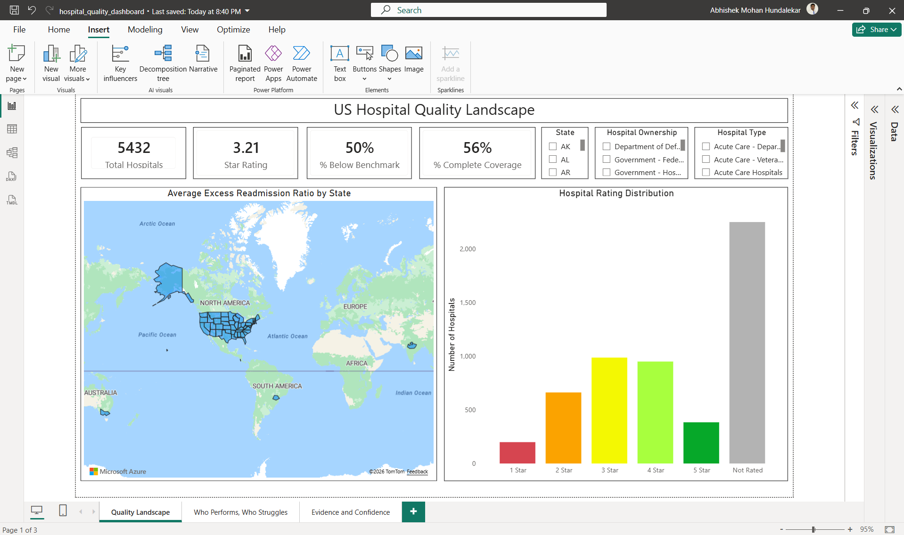
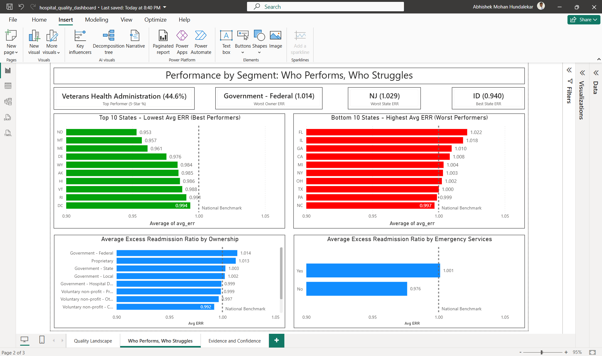
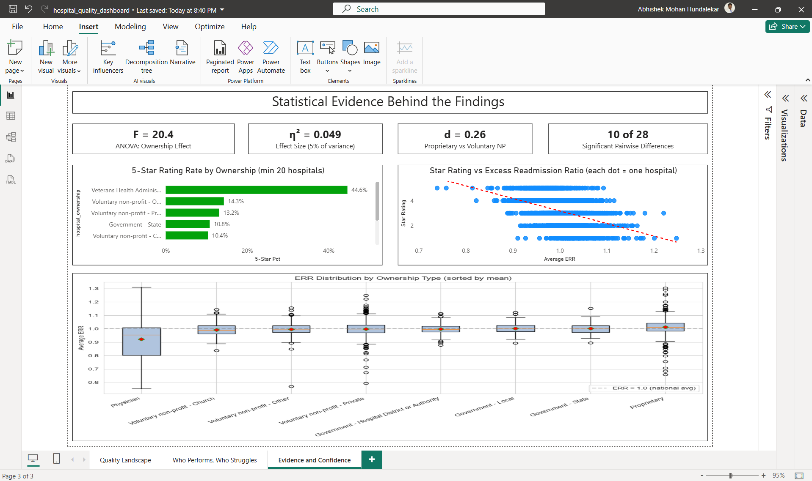

# Hospital Readmission & Quality Analytics

## Overview
End-to-end data analytics project analyzing US hospital quality across 4 CMS public datasets - covering clinical outcomes, readmissions, patient experience, and hospital characteristics.

## Business Question
*"Which hospital characteristics and quality measures are statistically associated with higher readmission rates and lower star ratings?"*

## Scale
- **5,432** US hospitals analyzed
- **445,458** total measure-level records
- **4** integrated CMS public datasets
- Coverage period: 2021 - 2025

## Datasets

| Dataset | Rows | Source |
|---|---|---|
| Hospital General Information | 5,432 | data.cms.gov |
| Complications and Deaths | 95,840 | data.cms.gov |
| HRRP Readmissions (FY 2026) | 18,330 | data.cms.gov |
| HCAHPS Patient Survey | 325,856 | data.cms.gov |

## Tech Stack

| Tool | Purpose |
|---|---|
| PostgreSQL 18 | Database engine |
| DBeaver | SQL client |
| Python (Pandas, SciPy, statsmodels) | Statistical analysis |
| Jupyter Notebook | Analysis notebooks |
| Power BI | Executive dashboard |
| Git / GitHub | Version control |

## Project Structure
Project 1/
├── datasets/                    # Raw CSVs (blocked from Git)
├── docs/                        # Charts and decision memo
│   ├── dist_*.png               # 6 distribution plots
│   ├── correlation_heatmap.png
│   ├── boxplot_err_ownership.png
│   ├── boxplot_err_all_ownership.png
│   └── forest_plot_err_ci.png
├── python/
│   └── 06_stats.ipynb           # Statistical analysis notebook
├── sql/
│   ├── 01_schema.sql            # Raw table definitions
│   ├── 02_load_data.sql         # COPY commands
│   ├── 03_cleaning.sql          # 4 cleaning views
│   ├── 04_transformation.sql    # 4 transformation views
│   └── 05_analysis.sql          # 8 analytical queries
├── powerbi/                     # Power BI dashboard (Stage 6)
├── .env.example                 # Template for DB credentials
├── .gitignore
└── README.md

## Stage 5: Statistical Analysis

Statistical testing performed in `python/06_stats.ipynb` using PostgreSQL view `v_hospital_master` (5,432 hospitals, 30 columns after dropping `avg_linear_score` due to r=0.99 redundancy with `patient_star_rating`).

### Tests Performed

| # | Test | Purpose | Result |
|---|---|---|---|
| 1 | Descriptive stats + Shapiro-Wilk | Check normality | All 4 metrics non-normal; CLT protects tests |
| 2 | Spearman correlation | Non-parametric relationships | Rating vs patient exp r=0.51, rating vs ERR r=-0.45 |
| 3 | Chi-square (rating vs ownership) | Categorical independence | Cramer's V 0.15 (small effect); small categories regrouped |
| 4 | Welch t-test + Mann-Whitney | Proprietary vs Voluntary NP-Private on ERR | Cohen's d 0.26 (small) |
| 5 | One-way ANOVA + Tukey HSD | ERR across 8 ownership types | F=20.4, eta-sq 0.049; 10 of 28 pairs significant |
| 6 | 95% Confidence Intervals | ERR by ownership; 5-star proportions | VA hospitals 44.6% 5-star (CI [35%, 54%]) |

### Method Choices

| Decision | Reason |
|---|---|
| Spearman over Pearson | Data non-normal |
| Welch t-test over Student's t | Unequal variances |
| Reported both parametric and non-parametric | Robustness check |
| Effect sizes alongside p-values | Prevent overclaiming |
| Regrouped small ownership categories | Chi-square assumption satisfied |

## Key Findings

| # | Finding |
|---|---|
| 1 | VA hospitals dominate 5-star ratings: 44.6% (CI [35%, 54%]) - over 2x the next best ownership type |
| 2 | Proprietary hospitals consistently worst: ERR 1.013, only 5.2% receive 5-star |
| 3 | Physician-owned hospitals lowest ERR (0.92) but 3x variance - selection bias suspected |
| 4 | Hospital size not related to readmissions (r=0.03) |
| 5 | CMS methodology validated: overall rating correlates with patient experience (0.51) and ERR (-0.45) |

## Analysis Notes

- All findings are **observed associations**, not causal claims
- Physician-owned hospital results likely reflect **selection bias** (patient case-mix, elective procedures)
- Both parametric and non-parametric tests reported for robustness
- Effect sizes reported alongside p-values throughout to prevent overclaiming statistical significance as practical importance

## Stage 6: Power BI Dashboard

Interactive 3-page dashboard built on PostgreSQL view `v_hospital_master` (Import mode). All pages share synchronized slicers (State, Hospital Ownership, Hospital Type) for cross-page filtering.

### Page 1: Quality Landscape
Executive overview of the hospital population.

- 4 KPIs: Total Hospitals (5,432), Avg Star Rating (3.21), % Below Benchmark (50%), % Complete Coverage (56%)
- Azure Map: Average Excess Readmission Ratio by state
- Hospital Rating Distribution bar chart with star-rating color palette (red-to-green)

### Page 2: Who Performs, Who Struggles
Segmentation analysis identifying best and worst performing groups.

- 4 KPIs: Top Performer (VA 44.6%), Bottom Performer (Government-Federal 1.014), Best State (ID 0.940), Worst State (NJ 1.029)
- Top 10 / Bottom 10 States by average ERR (green / red bar charts)
- Avg ERR by Ownership and by Emergency Services with National Benchmark reference line at 1.0

### Page 3: Evidence and Confidence
Statistical evidence supporting the findings.

- 4 statistical KPIs: ANOVA F=20.4, η²=0.049, Cohen's d=0.26, 10 of 28 pairwise significant
- 5-Star Rating rate by ownership (min 20 hospitals filter for statistical validity)
- Scatter: Star Rating vs Excess Readmission Ratio with trend line (r=-0.45)
- Box plot: ERR distribution across all 8 ownership types (from Stage 5 matplotlib output)

### DAX Measures Created
| Measure | Purpose |
|---|---|
| Total Hospitals | Row count |
| Avg Star Rating | Mean rating |
| % Below Benchmark | Share of hospitals with ERR > 1.0 |
| % Complete Coverage | Share of hospitals with complete data |
| Best Owner 5Star | Ownership category with highest 5-star share (min 20 hospitals) |
| Worst Owner ERR | Ownership category with highest avg ERR |
| Best State ERR | State with lowest avg ERR (min 10 hospitals) |
| Worst State ERR | State with highest avg ERR (min 10 hospitals) |
| 5-Star Pct | 5-star share within filter context |
| Rated Hospital Count | Count of hospitals with non-null rating (for min-N filters) |

### Design Decisions
| Decision | Rationale |
|---|---|
| Consistent color palette across pages | Red-to-green scale for ratings, blue for neutral metrics; users don't re-learn colors when navigating |
| National Benchmark reference line at ERR=1.0 | Instant readability - bars above are worse than expected, below are better |
| Min-N filters (20 for ownership, 10 for state) | Prevents small groups from producing misleading proportions |
| Static images for box plot | Power BI has no native box plot visual; matplotlib output preserves Stage 5 accuracy without marketplace dependency |
| Static KPIs on Page 3 | ANOVA, eta-squared, Cohen's d cannot be computed in native DAX; displayed as documented Python outputs |
| Synchronized slicers, visible only on Page 1 | Cleaner UI - slicers propagate filters without cluttering downstream pages |

## Decision Memo

A 1-page executive summary of findings, recommendations, and limitations is provided in `docs/decision_memo.md`. This document reframes the technical analysis for a hospital-executive audience, explicitly noting that findings are observed associations (not causal claims) and that intervention effects were not estimated.

## Project Stages

| Stage | Description | Status |
|---|---|---|
| 1 | Setup and Data Loading | Complete |
| 2 | Data Cleaning (SQL views) | Complete |
| 3 | Data Transformation (aggregation to hospital grain) | Complete |
| 4 | SQL Analysis (8 analytical queries) | Complete |
| 5 | Statistical Analysis (Python + Jupyter) | Complete |
| 6 | Power BI Dashboard | Complete |
